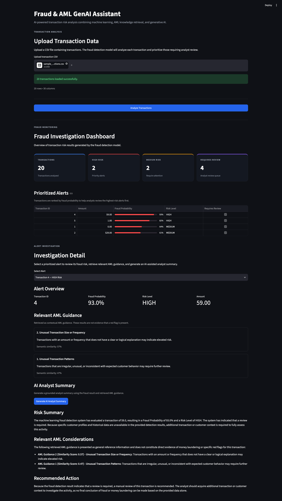

# fraud-aml-genai-assistant

# Fraud & AML GenAI Assistant

An end-to-end Fraud & AML analysis application that combines machine learning, retrieval-augmented generation (RAG), and generative AI to support fraud investigation workflows.

## Overview

The application allows users to upload transaction data, score transactions using a trained Random Forest fraud detection model, prioritize high- and medium-risk alerts, retrieve relevant AML guidance, and generate an AI-assisted analyst summary.

## Key Features

- Batch fraud scoring for large transaction datasets
- Risk classification into HIGH, MEDIUM, and LOW
- Prioritized analyst review queue
- Interactive Streamlit dashboard
- RAG-based AML guidance retrieval
- Gemini-generated analyst summaries
- Human-in-the-loop investigation workflow

## Model Performance

The Random Forest model achieved:

- Precision: 0.97
- Recall: 0.73
- F1-score: 0.83
- PR-AUC: 0.79

The model was selected because it provided the best balance between fraud detection performance and false positives.

## Batch Analysis

The application successfully analyzed more than 283,000 transactions in batch mode during local testing.

## Tech Stack

- Python
- Pandas
- Scikit-learn
- Random Forest
- Sentence Transformers
- RAG
- Gemini API
- Streamlit

## Project Workflow

```text
Upload CSV
    ↓
Fraud Detection Model
    ↓
Risk Scoring
    ↓
Prioritized Alerts
    ↓
AML Knowledge Retrieval
    ↓
AI Analyst Summary
    ↓
Human Analyst Review


## Application Preview


